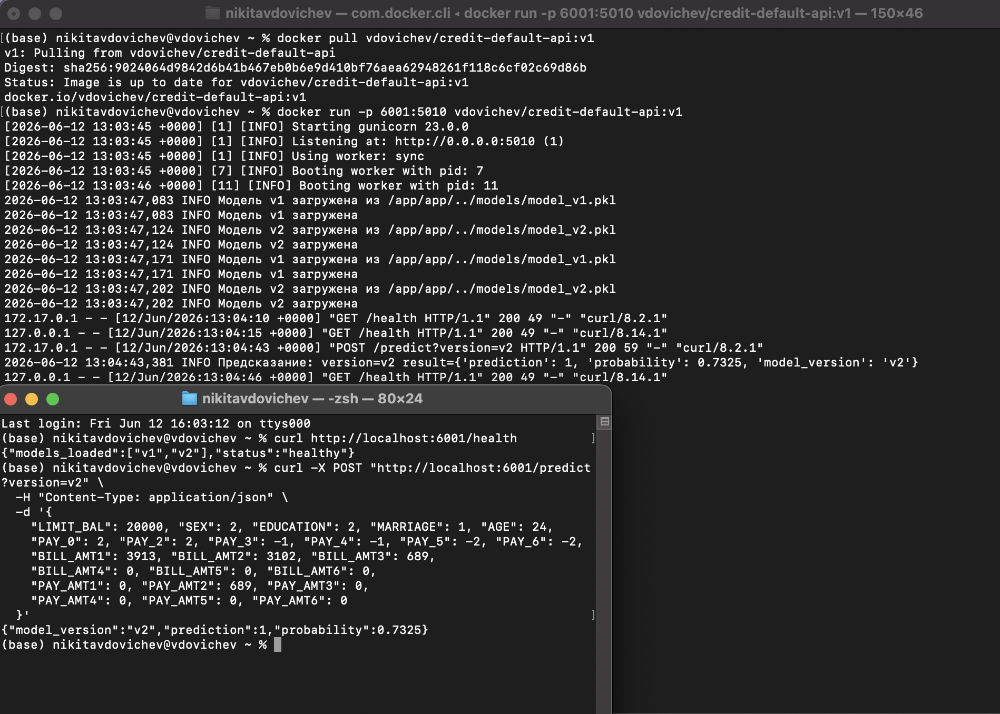

# Credit Card Default Prediction Service

Сервис ML для прогнозирования дефолта по кредитным картам.
Датасет: UCI Credit Card Clients Dataset

## Запуск

### Терминал
```bash
conda create -n ml_deployment python=3.11
conda activate ml_deployment
cd '/Users/nikitavdovichev/Documents/5 курс/ВнедрениеМоделейМЛ/credit-card-ml-deployment'
pip install -r requirements.txt
python models/train_model.py
python app/api.py
```

### Docker
```bash
cd '/Users/nikitavdovichev/Documents/5 курс/ВнедрениеМоделейМЛ/credit-card-ml-deployment'
docker build -f docker/Dockerfile -t credit-default-api:v1 .
MODELS_PATH="/Users/nikitavdovichev/Documents/5 курс/ВнедрениеМоделейМЛ/credit-card-ml-deployment/models"
docker run -p 5010:5010 -v "$MODELS_PATH:/app/models:ro" credit-default-api:v1
```

### Docker Compose
```bash
cd '/Users/nikitavdovichev/Documents/5 курс/ВнедрениеМоделейМЛ/credit-card-ml-deployment'
docker compose up --build
# API: http://localhost:5010  |  Nginx: http://localhost:80
```

## Примеры запросов

### GET /health
```bash
curl http://localhost:5010/health
# {"models_loaded":["v1","v2"],"status":"healthy"}
```

### POST /predict
```bash
curl -X POST http://localhost:5010/predict \
  -H "Content-Type: application/json" \
  -d '{
    "LIMIT_BAL": 20000, "SEX": 2, "EDUCATION": 2, "MARRIAGE": 1, "AGE": 24,
    "PAY_0": 2, "PAY_2": 2, "PAY_3": -1, "PAY_4": -1, "PAY_5": -2, "PAY_6": -2,
    "BILL_AMT1": 3913, "BILL_AMT2": 3102, "BILL_AMT3": 689,
    "BILL_AMT4": 0, "BILL_AMT5": 0, "BILL_AMT6": 0,
    "PAY_AMT1": 0, "PAY_AMT2": 689, "PAY_AMT3": 0,
    "PAY_AMT4": 0, "PAY_AMT5": 0, "PAY_AMT6": 0
  }'
# {"model_version":"v1","prediction":1,"probability":0.7755}
```

### POST /predict?version=v2 (A/B-тест)
```bash
curl -X POST "http://localhost:5010/predict?version=v2" \
  -H "Content-Type: application/json" \
  -d '{
    "LIMIT_BAL": 20000, "SEX": 2, "EDUCATION": 2, "MARRIAGE": 1, "AGE": 24,
    "PAY_0": 2, "PAY_2": 2, "PAY_3": -1, "PAY_4": -1, "PAY_5": -2, "PAY_6": -2,
    "BILL_AMT1": 3913, "BILL_AMT2": 3102, "BILL_AMT3": 689,
    "BILL_AMT4": 0, "BILL_AMT5": 0, "BILL_AMT6": 0,
    "PAY_AMT1": 0, "PAY_AMT2": 689, "PAY_AMT3": 0,
    "PAY_AMT4": 0, "PAY_AMT5": 0, "PAY_AMT6": 0
  }'
# {"model_version":"v2","prediction":1,"probability":0.7325}
```

## Формат запроса — 23 признака

| Признак | Описание |
|---|---|
| LIMIT_BAL | Кредитный лимит |
| SEX | 1=мужской, 2=женский |
| EDUCATION | 1=аспирантура, 2=университет, 3=школа, 4=другое |
| MARRIAGE | 1=женат, 2=холост, 3=другое |
| AGE | Возраст |
| PAY_0–PAY_6 | История платежей (-2=нет долга, -1=погашено, 1–9=просрочка N мес.) |
| BILL_AMT1–6 | Сумма счёта (апрель–сентябрь) |
| PAY_AMT1–6 | Сумма предыдущего платежа |

## Тесты
```bash
conda activate ml_deployment
cd '/Users/nikitavdovichev/Documents/5 курс/ВнедрениеМоделейМЛ/credit-card-ml-deployment'
API_PORT=5010 pytest tests/test_api.py -v
API_PORT=5010 python tests/ab_test.py

API_PORT=80 pytest tests/test_api.py -v # nginx
API_PORT=80 python tests/ab_test.py # nginx
```

## Docker Hub
https://hub.docker.com/r/vdovichev/credit-default-api/tags  
```bash
docker pull vdovichev/credit-default-api:v1
docker run -p 6001:5010 vdovichev/credit-default-api:v1
curl http://localhost:6001/health
curl -X POST "http://localhost:6001/predict?version=v2" \
  -H "Content-Type: application/json" \
  -d '{
    "LIMIT_BAL": 20000, "SEX": 2, "EDUCATION": 2, "MARRIAGE": 1, "AGE": 24,
    "PAY_0": 2, "PAY_2": 2, "PAY_3": -1, "PAY_4": -1, "PAY_5": -2, "PAY_6": -2,
    "BILL_AMT1": 3913, "BILL_AMT2": 3102, "BILL_AMT3": 689,
    "BILL_AMT4": 0, "BILL_AMT5": 0, "BILL_AMT6": 0,
    "PAY_AMT1": 0, "PAY_AMT2": 689, "PAY_AMT3": 0,
    "PAY_AMT4": 0, "PAY_AMT5": 0, "PAY_AMT6": 0
  }'
```
Доказательство что образ скачивается и работает:  


## Структура

credit-card-ml-deployment/
├── app/ # api.py + model_handler
├── models/ # train_model.py + .pkl моделей + .json метрик
├── tests/ # test_api.py + ab_test.py
├── docker/ # Dockerfile + nginx.conf
├── docker-compose.yml
├── requirements.txt
├── ab_test_plan.md
├── architecture.md
├── working.png
└── README.md